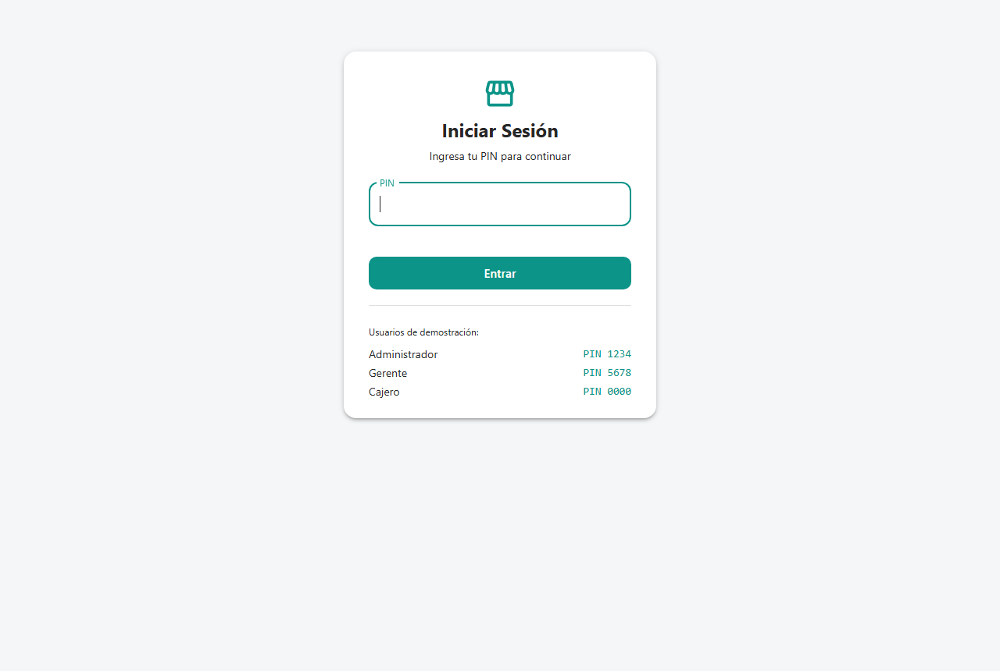
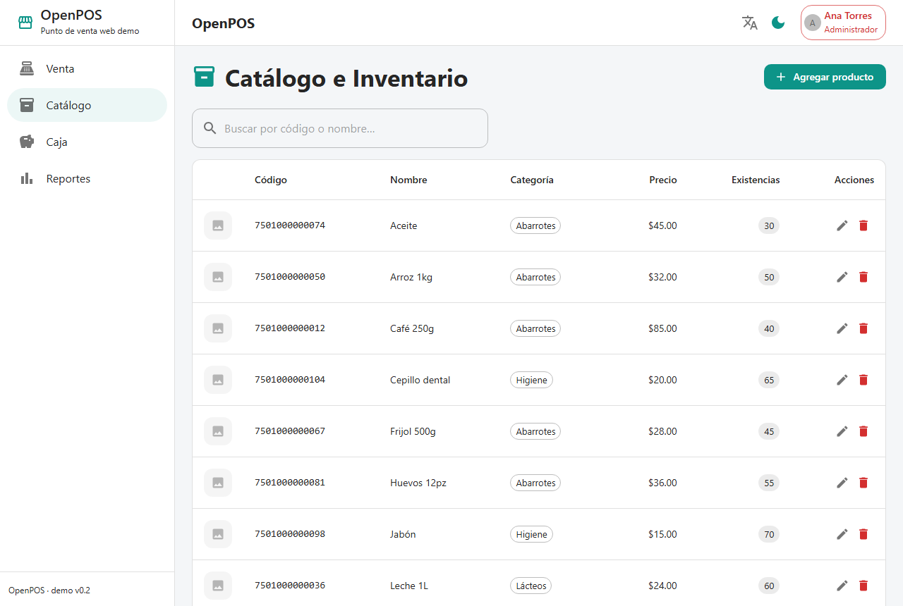
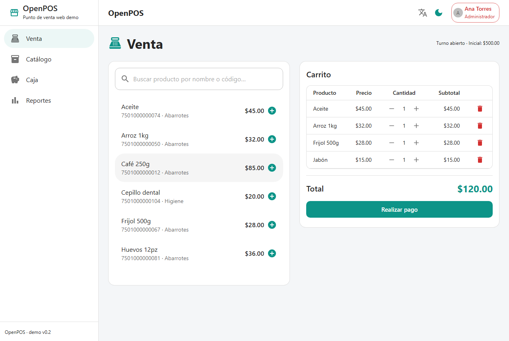
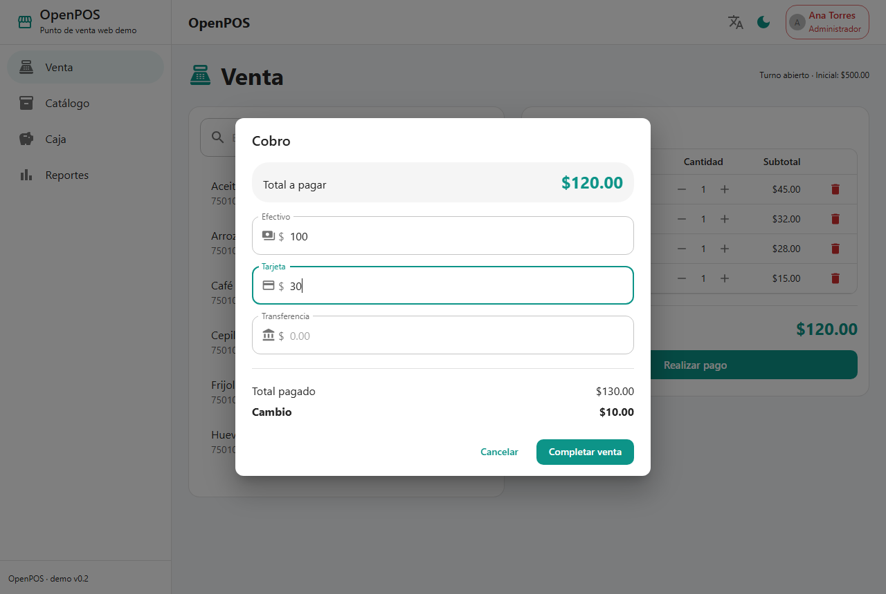
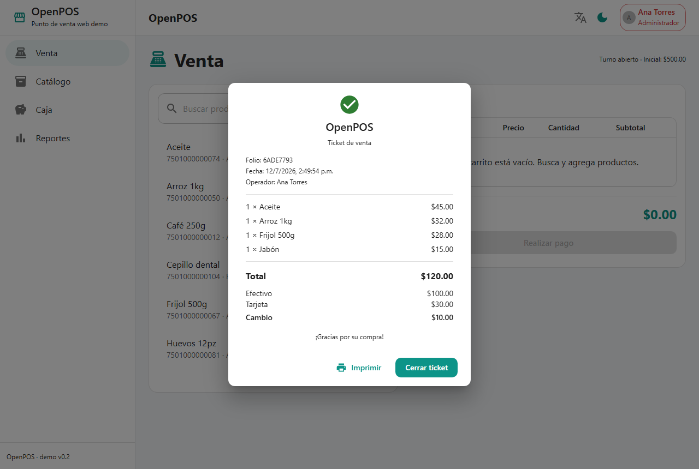
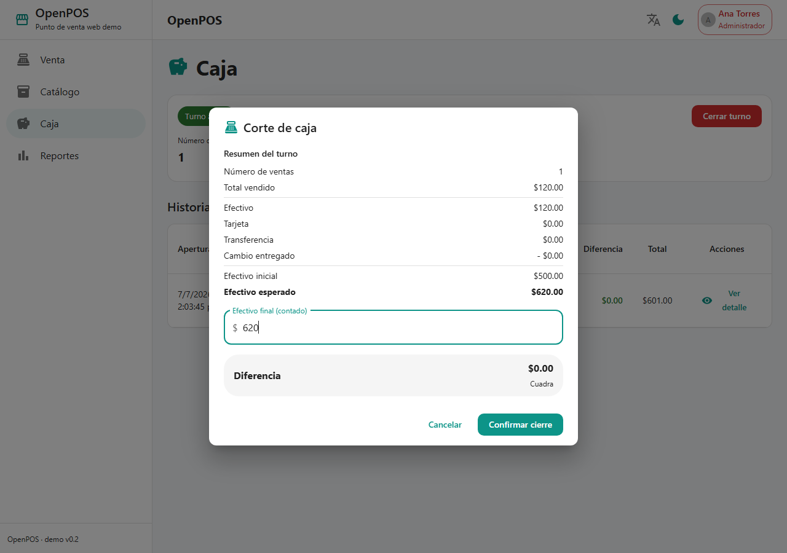
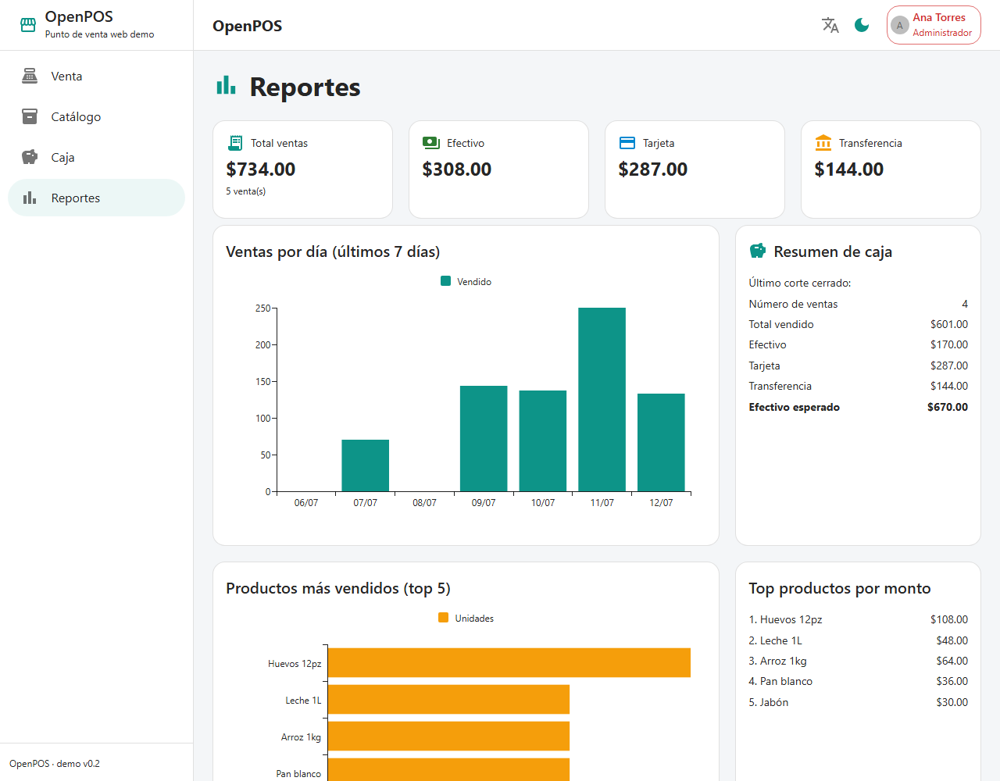
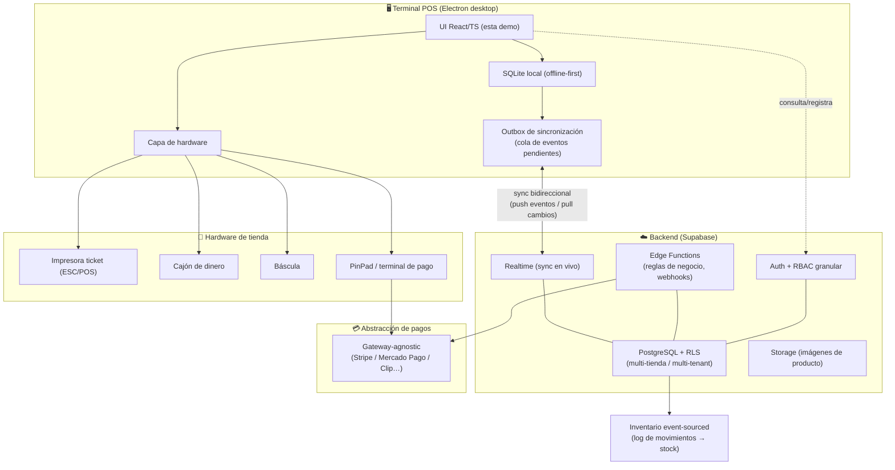

# OpenPOS — Punto de venta web (demo)

**OpenPOS** es una aplicación web de punto de venta (POS) de demostración, genérica y
con datos ficticios. Muestra cómo se construye un POS moderno de comercio con React,
TypeScript y Material UI: login con roles, venta con pago mixto, catálogo/inventario,
caja con corte, reportes y diseño offline-first.

### 🔗 Demo en vivo: **https://agc-openpos.pages.dev**
### 💻 Código: **https://github.com/DilanProjects1001/open-pos-demo**

> Entra con el PIN **1234** (Administrador). La app es una demo autocontenida: los datos
> viven en el navegador (IndexedDB) y vienen sembrados con productos, ventas y un corte
> de caja de ejemplo.

> **Estado: demo funcional COMPLETA + módulos de gestión.** Login con roles (PIN),
> catálogo/inventario (CRUD), venta con pago mixto y ticket, caja (apertura + cierre/corte
> con historial) y reportes (dashboard con gráficas). Además: **Clientes** (CRUD, historial,
> saldo/puntos), **Proveedores** (CRUD), **Compras/Entradas** (suben stock, insert-only),
> **Apartados** (con abonos), **Fidelización/Puntos** (configurable, canje en ventas) y
> **Devoluciones** (reponen stock y restan caja; solo gerente/admin). Todo offline-first
> sobre IndexedDB, i18n es-MX/en, tema claro/oscuro, con autotest (`node check.js`) y tests
> unitarios (`npx vitest run`).

---

## Capturas

| Login | Catálogo |
|-------|----------|
|  |  |

| Venta (carrito) | Pago mixto |
|-----------------|------------|
|  |  |

| Ticket | Corte de caja |
|--------|---------------|
|  |  |

| Reportes (dashboard) |
|----------------------|
|  |

---

## ¿Qué es y para qué sirve? (en simple)

Es la "caja registradora" de una tienda, pero en el navegador. Permite: iniciar sesión
con distintos roles (cajero, gerente, administrador), cobrar ventas con **pago mixto**
(efectivo + tarjeta + transferencia) con cálculo de cambio y **ticket**, administrar el
**catálogo e inventario**, **abrir/cerrar la caja** y hacer el **corte** (con diferencia
esperado vs contado e historial), y ver **reportes** con gráficas. Funciona sin internet
(offline-first) usando la base de datos del propio navegador (IndexedDB).

## Cómo abrirla / usarla

Requisitos: Node.js 18+ instalado.

```bash
npm install       # instala dependencias (solo la primera vez)
npm run dev       # abre el servidor de desarrollo (http://localhost:5173)
npm run build     # compila la versión de producción a dist/
npm run preview   # sirve la versión compilada
```

Usuarios de demostración:

| Usuario | Rol | PIN |
|---------|-----|-----|
| Ana Torres | Administrador | `1234` |
| Luis Prado | Gerente | `5678` |
| Sofía Ruiz | Cajero | `0000` |

Tras entrar se muestra el módulo de **Venta**. Usa el menú lateral para navegar. Arriba a
la derecha puedes cambiar el **idioma** (español ⇄ inglés) y el **tema** claro/oscuro, ver
el **operador actual** y hacer **cambio rápido de operador** o **cerrar sesión**. El módulo
de **Reportes** y el cierre de caja solo están disponibles para admin y gerente.

### Pruebas

```bash
node check.js     # validaciones estáticas sin navegador (ver SELFTEST.md)
npx vitest run    # tests unitarios (corte de caja, dinero, permisos)
```

---

## Arquitectura de esta demo

```
┌──────────────────────────────────────────────────────────────────────┐
│                          Navegador (SPA)                               │
│   React + TypeScript + Vite + MUI                                      │
│                                                                        │
│   Providers globales (main.tsx)                                        │
│     • ColorModeProvider → tema claro/oscuro (theme.ts)                 │
│     • i18n (i18next)     → es-MX / en                                  │
│     • AuthProvider       → sesión + roles (PIN)                        │
│     • BrowserRouter      → enrutado de la SPA                          │
│                              │                                          │
│                              ▼                                          │
│   Layout (sidebar + topbar)  →  ProtectedRoute (sesión + rol)          │
│         ┌──────────┬─────────┼──────────┬──────────────┐               │
│         ▼          ▼         ▼          ▼              ▼               │
│      Login       Venta    Catálogo     Caja        Reportes            │
│     (roles)   (pago mixto) (CRUD/inv) (corte)    (dashboard)           │
│                              │                                          │
│                              ▼                                          │
│   Capa de datos (src/db) — dinero en centavos, funciones puras         │
│     • IndexedDB (idb): products · sales · cashSessions                 │
│     • seed.ts: datos ficticios al primer arranque                      │
│     • reports.ts / cash.ts: agregaciones puras (testeables)            │
└──────────────────────────────────────────────────────────────────────┘
                              │
                              ▼
     Cloudflare Pages (proyecto agc-openpos, _redirects → SPA fallback)
```

### Decisiones de diseño

- **Dinero en enteros de centavos:** todos los importes son enteros (centavos) para
  evitar errores de punto flotante; el formateo a moneda es solo de presentación.
- **Offline-first:** el estado del negocio vive en IndexedDB (`idb`); la app funciona sin
  conexión.
- **Lógica pura y testeable:** `summarizeSession`, `salesPerDay`, `topProducts`,
  `methodTotals`, `canCloseShift`, `parseCurrencyToCents` son funciones puras cubiertas
  por Vitest.
- **i18n desde el día 1** y **tema centralizado** (`src/theme.ts`, paleta teal + ámbar).

### Stack

| Área | Tecnología |
|------|------------|
| UI | React + TypeScript |
| Build | Vite |
| Componentes | Material UI (MUI) + iconos |
| Gráficas | @mui/x-charts |
| Enrutado | react-router-dom |
| i18n | i18next + react-i18next |
| Persistencia | IndexedDB (idb) — offline-first |
| Tests | Vitest + fake-indexeddb |
| Despliegue | Cloudflare Pages |

---

## Full Production Architecture (visión a producción)

Esta demo es el front-end de un POS. Así se vería el sistema **completo y productivo** al
que este código serviría de base. (Diagrama conceptual; no todo está implementado en la
demo.)



**Piezas clave de esa visión:**

- **Electron desktop:** empaqueta esta UI como app de escritorio para la terminal de caja,
  con acceso a hardware y arranque sin navegador.
- **Offline-first con SQLite + Outbox sync:** las ventas se registran localmente aunque no
  haya internet; un patrón **Outbox** encola los eventos y los sincroniza (push/pull)
  cuando vuelve la conexión, resolviendo conflictos por evento.
- **Supabase (Postgres + RLS + Realtime + Edge Functions):** base multi-tienda con
  **Row-Level Security** por tenant, sincronización en vivo (Realtime), y reglas de negocio
  en Edge Functions (webhooks de pago, cierres, reportes).
- **Inventario event-sourced:** el stock no se sobrescribe; se deriva de un **log de
  movimientos** (entradas, ventas, mermas, ajustes), lo que da auditoría y trazabilidad.
- **Hardware:** impresión **ESC/POS**, apertura de **cajón**, **báscula** para graneles y
  **PinPad** para cobro con tarjeta.
- **RBAC granular:** permisos finos por acción (no solo por rol), p. ej. "puede cerrar
  turno", "puede aplicar descuento", "puede anular venta". En la demo esto se prototipa en
  `src/auth/permissions.ts` (`canCloseShift`).
- **Abstracción de pagos:** capa gateway-agnostic para cambiar de proveedor
  (Stripe / Mercado Pago / Clip…) sin tocar la lógica de venta; en la demo se prototipa con
  los métodos `cash` / `card` / `transfer`.

---

## Estructura de carpetas

```
src/
  main.tsx                 Entrada + providers globales + seed inicial
  App.tsx                  Rutas (protegidas por sesión y rol)
  theme.ts / i18n.ts       Tema MUI (claro/oscuro) e i18n
  theme/ColorModeContext.tsx   Contexto y toggle de tema
  auth/
    AuthContext.tsx        Sesión, usuarios/PIN, login/logout/cambio de operador
    ProtectedRoute.tsx     Protege rutas por sesión y rol
    OperatorSwitchDialog.tsx  Modal de cambio rápido de operador
    permissions.ts         Permisos por rol (canCloseShift…)
  db/
    db.ts                  IndexedDB + interfaces (Product, Sale, CashSession…)
    products.ts sales.ts   CRUD de productos / ventas
    cash.ts                Caja: abrir/cerrar turno, resumen (corte)
    reports.ts             Agregaciones del dashboard (por día, top productos, método)
    seed.ts                Semilla (10 productos + 5 ventas + 1 corte cerrado)
  utils/format.ts          formatCurrency / parseCurrencyToCents
  components/
    PaymentDialog.tsx      Pago mixto con cálculo de cambio
    TicketDialog.tsx       Ticket de venta (con impresión)
    CloseShiftDialog.tsx   Corte de caja (resumen + diferencia)
    SessionDetailDialog.tsx  Detalle de un corte
  layout/Layout.tsx        Sidebar (menú por rol) + topbar
  locales/es-MX.json en.json   Traducciones
  pages/                   Login · Catálogo · Venta · Caja · Reportes
  __tests__/               Tests unitarios (Vitest)
check.js                   Validaciones estáticas sin navegador
public/_redirects          SPA fallback para Cloudflare Pages
scripts/shots*.mjs         Capturas por iteración (maneja Edge headless)
ui_shots/                  Capturas de evidencia visual
```

## Hoja de ruta

- [x] **Iter 0** — Base: layout, navegación, tema claro/oscuro, i18n, login (UI).
- [x] **Iter 1** — Autenticación con roles (PIN), rutas protegidas, cambio de operador.
- [x] **Iter 2** — Catálogo/Inventario: CRUD de productos en IndexedDB con datos semilla.
- [x] **Iter 3** — Venta: carrito, pago mixto, ticket, apertura de turno.
- [x] **Iter 4** — Caja: cierre/corte con diferencia, historial de cortes, tests unitarios.
- [x] **Iter 5** — Reportes: dashboard con gráficas (ventas por día, top productos, caja).
- [x] **Iter 6** — Despliegue a Cloudflare Pages (`agc-openpos`) + repo público.
- [x] **Iter 7** — Módulos de gestión: Clientes, Proveedores, Compras, Apartados, Fidelización, Devoluciones.

---

## English summary

**OpenPOS** is a demo web Point-of-Sale app built with React + TypeScript + Vite + MUI.
It is a **complete functional demo**: role-based PIN login (cashier / manager / admin),
sales with **mixed payment** (cash + card + transfer) with change calculation and a
printable **receipt**, catalog & inventory CRUD, a **cash drawer** with open/close and a
**cash count** (expected vs counted difference + history), and a **reporting dashboard**
with charts (sales per day, top products, cash summary). Money is handled as integer
cents. It is **offline-first** using IndexedDB, fully internationalized (es-MX / en) with
light/dark themes, and covered by unit tests (Vitest).

**Live demo:** https://agc-openpos.pages.dev · **Code:** https://github.com/DilanProjects1001/open-pos-demo

Run locally with `npm install && npm run dev`, then sign in with PIN `1234`.

The README also documents a **Full Production Architecture** (Electron desktop, Supabase
Postgres/RLS/Realtime/Edge Functions, SQLite offline-first with Outbox sync, event-sourced
inventory, ESC/POS hardware, granular RBAC, and a gateway-agnostic payment abstraction)
that this front-end is designed to grow into.
